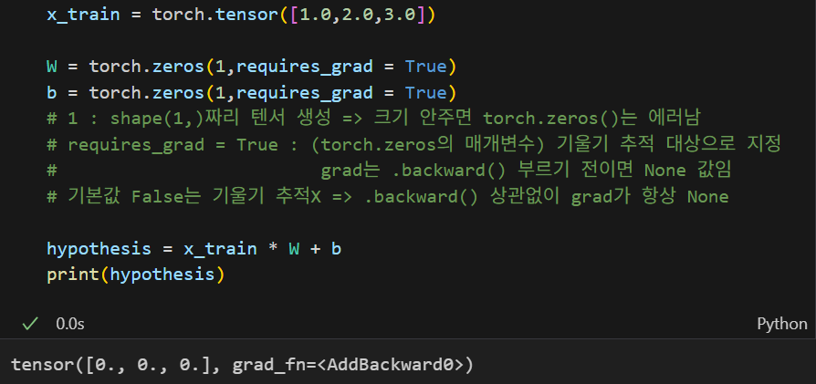
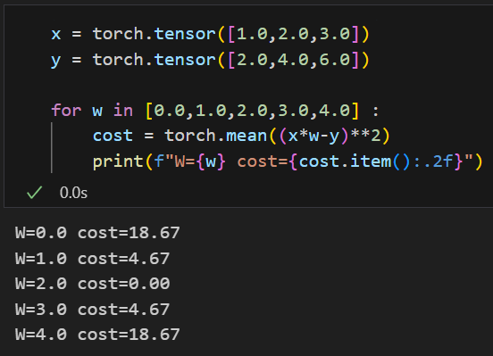
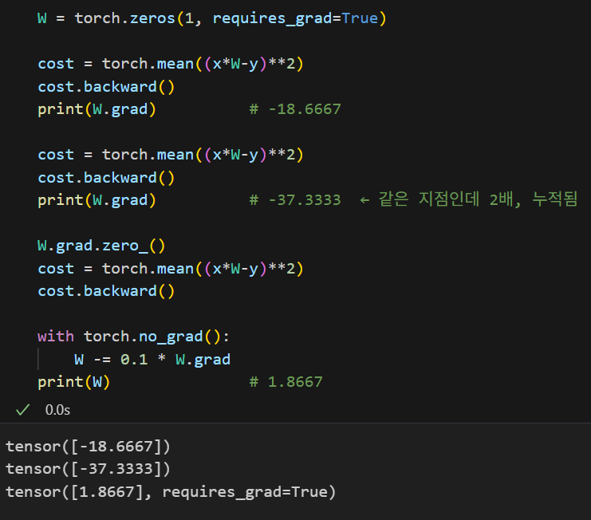
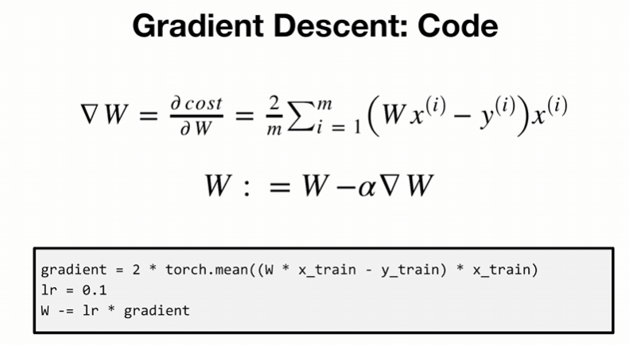
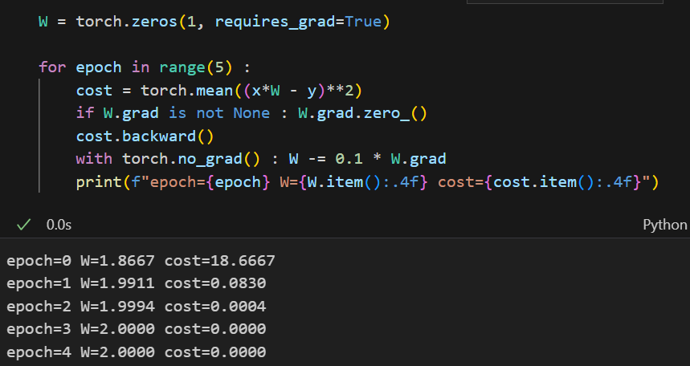

# Deeper look at GD

## 학습 과정

```
가설 형태 결정 (H(x) = Wx + b)
            ▼
현재 가설로 예측 (Hypothesis)
            ▼
이 가설이 얼마나 틀렸는가 (cost function)  <- 여기가 평가 구간임
            ▼
덜 틀린 가설로 이동 (Gradient Descent)     <- 여기가 갱신
            ▼
           반복
```

---

## 1. Linear Regression (선형 회귀)



- 선형 회귀를 한다는 것 자체가 뒤에 나오는 cost function과 Gradient Descent를 포함함
- 포함 관계인 동시에 LR -> CF -> GD 순서가 반복되는 구조임

- 상단 코드 기준으로 W=0, b=0에서 시작해 조금씩 조정하며 찾아나감. 이때 출력된 tensor([0., 0., 0.])은 W, b가 아니라 그 값으로 만든 예측값(H)이고, 본격적인 학습(예측은 했지만 CF, GD 아직 안함) 전이라 전부 0인 상태임

- **W(가중치)** : 직선의 기울기. 입력이 결과에 어느 방향으로 얼마나 영향을 미치는지 결정함. 부호도 정보이며, W가 0에 가까우면 그 입력은 결과와 무관하다는 의미임
- **b(편향)** : y절편. 직선을 위아래로 평행 이동시키는 역할. b가 없으면 원점을 지나는 직선만 표현 가능해져 모델의 표현 범위가 좁아짐
- **H(가설)** : 현재 W, b로 만들어낸 예측값. W와 b의 값이 정해지는 순간 가설 하나가 확정됨.

---

## 2. cost function (loss 함수)



- 위의 코드는 requires_grad, .backward()없이 W값 5개를 하나씩 넣어 cost를 찍어봄. b는 0으로 고정(x\*w-y)해 W 하나에 대한 곡선만 봄
  (x는 입력값, y는 정답 레이블 => W 갱신은 없으므로 학습 X, 확인용)

- Linear Regression에서 H(x)를 만들었으니, 그 H(x)가 정답 y에서 얼마나 떨어져 있는가를 하나의 숫자로 압축하는 단계임. W 갱신을 반복하며(학습) H(x)의 출력이 y에 맞추는 게 최종 목표임.

- 오차를 스칼라로 압축하는 방식은 여러 가지임. 대표적으로 MSE(평균제곱오차)와 MAE(평균절댓값오차)가 있음. MSE가 기본값처럼 쓰이는 이유는 더 정확해서가 아니라 다루기 좋아서임
  - **제곱** : 부호 상쇄를 막고 큰 오차에 더 큰 페널티를 줌. 더 중요한 건 모든 지점에서 미분이 매끄럽고 볼록하다는 점. 절댓값은 0에 꺾여 미분이 정의되지 않음. 뒤에 나올 GD가 성립하는 전제가 여기서 확보됨. 선형회귀에 한해서는 닫힌 해(정규방정식)까지 존재함.
  - **평균** : 데이터 개수에 cost 크기가 비례하지 않도록 정규화. 데이터가 100배 늘어도 learning rate를 다시 잡을 필요가 없음.
  - => 단, 기본값이지 정답은 아님. 제곱은 이상치의 오차까지 제곱해 키우므로, 이상치가 많은 데이터에서는 소수의 점이 W를 끌고 감. 이럴 땐 MAE나 Huber(δ 안쪽은 제곱, 바깥은 절댓값 - 하이퍼파라미터 하나를 추가해 유연성을 얻음)가 나올 수 있음


- W를 다이얼처럼 돌려가며 cost를 그리면 U자 골짜기 모양 (W에 대한 볼록 이차함수)
  cost = 0은 완벽히 예측했다는 의미

- 최저점이 유일 => 볼록한 형태라 어디서 출발해도 같은 바닥에 수렴함.
  단, 선형+MSE 한정이고 신경망(볼록 형태X)은 해당 없음

- 현재 위치가 바닥의 어느 쪽인지는 기울기 부호가 알려줌
  음수면 최저점 좌측, 양수면 최저점 우측

- loss(cost) function은 "무엇을 최소화할지"를 정의하는 축이고, optimizer는 "어떻게 최소화할지"를 정하는 축임. 둘은 상하가 아니라 병렬. MSE·CE·KL은 발전 단계가 아니라 비교 대상(값/정답/분포)에 따른 선택지이며, 한 loss 안에 함께 쓰이기도 함.

- 유일성은 답이 하나라는 보장일 뿐 찾는 방법은 아님 => 식을 못 푸는 상황에서 기울기 따라 내려가는 GD 개념이 필요함

---

## 3. Gradient Descent (경사하강법)



- cost function은 W 5개를 직접 나열해 전부 대입해본 것이라, 정답이 1.7이면 못 찾음
  간격을 촘촘히 해도 원리는 같고, W와 b 둘로 늘면 조합이 제곱으로 폭발함
  => 나열이 아니라 기울기로 방향을 계산해 이동하는 방식이 필요함. 이때 기울기 하나가 두 가지를 동시에 알려줌
  - 부호 : 어느 쪽으로 갈지 (음수면 W 키우고, 양수면 줄임)
  - 크기 : 얼마나 갈지 (바닥에서 멀수록 큼)

- 동일한 코드 블록(3줄)이 2번 반복되는데 출력이 다름을 확인할 수 있음. 그 이유는 .backward()가 W.grad를 덮어쓰지 않고 더하기 때문

- 첨부한 코드의 하단에 올바른 스텝도 하나 제시되어 있음

| 줄 | 하는일 | 없으면 |
|---|---|---|
| zero_() | 쌓은 -37.3333을 0으로 | 3.7333으로 튐 |
| cost | 현재 위치의 오차 | 미분 대상이 없음 |
| backward() | W.grad에 -18.6667 채움 | 방향을 모름 |
| W -= ... | 실제로 W가 바뀜 | 영원히 제자리 |

- backward 역전파는 W(파라미터)를 갱신하는 것이 아니라, W.grad를 갱신하고 출력(cost) 쪽에서 입력(파라미터) 쪽으로 방향을 전환함
- 그렇다면 backward가 채운 그 값은 어떤 식으로 계산된 것인가 => 아래 수식



- ∇W는 현재 위치에서의 기울기임을 의미함. 상수가 아니라 유동성있는 W의 함수임

- 곡선 위 현재 지점의 접선 기울기이므로, 위치가 바뀌면 값도 바뀜(그래서 매 스텝 backward()를 다시 호출). U자 곡선은 바닥에서 멀수록 가파르고 가까울수록 완만하므로 ∇W가 자동으로 작아짐. 실제로 이 예제에서 ∇W=9.333(W-2)로, 정답과의 거리에 비례함. α가 고정인데도 수렴하는 이유가 이것이며, W=2에서는 ∇W=0이라 정지함.



- 반복문에 넣으면 큰 오차는 큰 보폭으로 빠르게 줄이고, 정답에 가까워질수록 보폭이 저절로 작아져 정밀하게 접근함. 첫 스텝에서 전체 거리의 93%를 끝냄. 별도 조건은 없이 ∇W의 성질만으로 자동 발생함

- epoch3에서 이미 수렴. 이후는 ∇W=0이라 W가 움직이지 않음
  => epoch을 늘린다고 더 좋아지지 않음. 데이터 3개짜리 선형 문제라 빠른 것이고 실제 학습은 수백~수천 epoch이 필요함

- 단, 초기 보폭 a는 사람이 정해야 함. a가 너무 크면 정답을 지나쳐 발산하는데, 발산하지 않는 상한을 안정 조건이라 하고 이 값은 데이터가 정해둠. 상단에 첨부한 코드 기준으로는 약 0.214로 잡히는데 a=0.25로 바꾸면 실제로 발산함.

- 상한을 계산할 수 있는 것은 선형+MSE 한정이며, 신경망은 구할 수 없어 경험적으로 잡음 => a가 하이퍼파라미터인 이유

- b가 빠져있는데, b가 들어가면 cost가 곡선에서 곡면이 되고 편미분이 2개가 됨. 다만 갱신 식이 하나 늘 뿐 원리는 W와 동일함.
