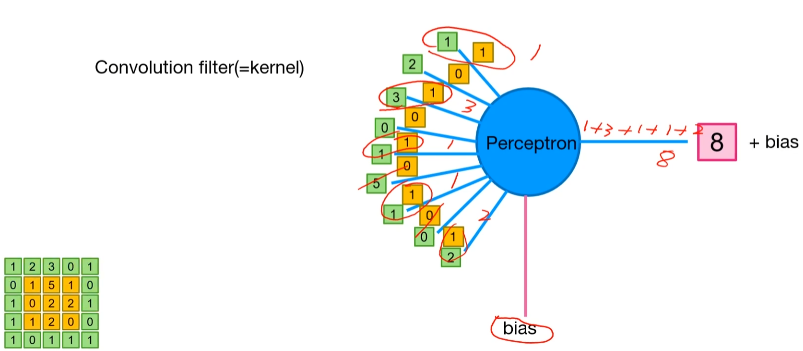

## Convolution


- input, filter, output으로 구성되어 있음

- 이미지 위에서 stride 값 만큼 filter(kernel)을 이동시키면서 겹쳐지는 부분의 각 원소의 값을 곱해서 모두 더한 값을 출력하는 연산


- 입력 형태

    - input type : Torch.Tensor

    - input shape : ( N x C x H x W )

        

        ⇒ batch_size, channel, height, width

        


- conv 구성

    - 입력 이미지 채널 수 (1)

    - 출력으로 만들고 싶은 채널 수 (1)

    - input image size (227 x 227)

    - filter size (11 x 11)

    - stride (4)

        - filter를 한번에 얼마나 이동 할 것인가, 보폭

    - padding (0)

        - zero-padding을 몇 줄로 할 것 인가를 지정함

        - 적당히 주면 안정적이고, 너무 많이 주면 오히려 비효율적 일수도 있음

        - 가장자리 픽셀도 여러 번 컨볼루션 참여하여 연산 빈도 격차 극복함


- Convolution의 output 크기

  $$Output=\lfloor\frac{Input-Filter+2\times Padding}{Stride}\rfloor+1$$


```python

import torch

import torch.nn as nn


conv = nn.Conv2d(1,1,11,stride=4, padding=0)


inputs = torch.Tensor(1,1,227,227)

print(inputs.shape)


out = conv(inputs)

print(out.shape)

```


> 

> 

> 

> torch.Size([1, 1, 227, 227])

> torch.Size([1, 1, 55, 55])

> 


- **퍼셉트론** : 여러개의 입력값을 받아 각각의 중요도(가중치)를 모두 곱한 뒤 더함.

    

                      그 결과를 기반하여, 다음 단계로 어떤 신호를 보낼지 결정함 

    

              ⇒ 그림에서 파란색

    

- **컨볼루션** : 전체 데이터를 한 번에 처리하지 않고, 특정 크기의 필터(커널)을 데이터 위로


                           슬라이딩하면서 겹치는 부분의 값들을 곱하고 더해 새로운 특징 값을 만들어냄


                    ⇒ 그림에서 초록색 상자(입력 데이터)와 노란색 상자(컨볼루션 필터/커널)이 짝지어 곱해지는 과정 자체가 컨볼루션 연산


- **바이어스** : 모든 입력 값이 0일때도 모델이 0이 아닌 다른 결괏값을 출력할 수 있게 해주는 ‘유연성’을 제공함.

    

                       1차 함수의 y절편과 같은 역할을 하여, 모델이 정답 데이터에 더 정확하게 맞춰질 수 있도록 축을 이동 시켜줌.

    

                (퍼셉트론의 최종 합산 과정에서 더해지는 일종의 상수)

    





## Pooling


핵심 정보만 남기고 크기를 줄여버리는 요약 과정


- Max Pooling

- Average Pooling


## CNN implementation


```python

import torch

import torch.nn as nn


inputs = torch.Tensor(1,1,28,28)


conv1 = nn.Conv2d(1,5,5)

pool = nn.MaxPool2d(2)


out = conv1(inputs)

out2 = pool(out)


print(out.size()) # 5 * 5 필터를 통과 시켜 5가지 형태의 새로운 이미지 특징 맵을 새로 만들겠다

print(out2.size()) # 핵심 신호만 압축하겠다 

```


> 

> 

> 

> torch.Size([1, 5, 24, 24])

> torch.Size([1, 5, 12, 12])

> 


< 참고 >


Convolution과 Cross-corelation의 차이


- 뒤집고 계산하면 Convolution

- 안뒤집고 계산하면 Cross-Correlation


⇒ 연산 측면에서 보면 순서만 다르지 연산 방법 자체는 동일함


Convolution으로 안되던게 Cross-Correlation으론 된다 같은 경우는 없다고 봐도 무방함


단, 신호 처리에서 교환 법칙 관련한 증명에서는 엄격히 구분된다고 하니 나중에 필요하면 찾아보기. CV관점에서는 중요X

