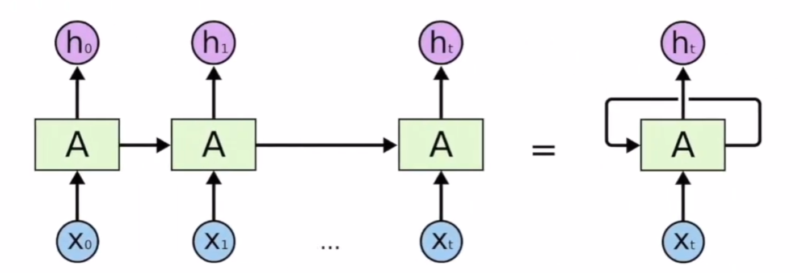
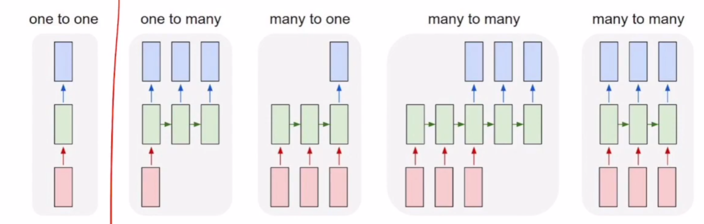

## Recurrent Neural Network


- 순환 신경망

- 단순 NN은 위치마다 별도의 가중치가 필요하고, 길이가 고정되어 순서 데이터를 다루기 비효율적이었음

    

    ⇒ RNN은 파라미터 재사용과 은닉 상태 순환을 통해 가변 길이의 순서 데이터를 효율적으로 처리할 수 있게 되었음

    





- 가장 오른쪽 그림을 펼치면 좌측 그림과 같아짐

    - A는 시점 별 동일한 RNN 셀이고 오가는 화살표가 전달하는 값이 hidden state임

- RNN은 모든 셀이 전부 파라미터를 공유함.

    

    ex) hello라는 문자를 받을 때, l뒤에 l이 올 수도 있고, o가 올 수도 있는 문제를 해결함

    

- 복잡한 셀을 쓰면, 같은 수준의 학습에서는 좋은 성능을 띄고 그 학습 수준에 도달하기까지는 더 많은 학습 차원이 필요함

- **복잡도 : 기본 RNN < GRU < LSTM**

    - RNN의 치명적인 단점이.

        

        장기 의존성 문제(앞쪽 정보 옅어짐), 병렬 처리 불가인데 

        

        이 문제를 해결하기 위해 나온 것들이 GRU/LSTM 이나 Transformer 임

        


## RNN 구분





- one to one은 일반적인 neural network, 나머지는 모두 RNN

- one to many : 하나의 단어 넣었을 때 문장 도출

- many to one : 문장이 입력되면 하나의 감정 레이블(?) 도출 task (어떤 감정을 가지고 있느냐 분류)

- many to many (공백 O) : 비동기/지연 방식으로 번역 task에 적합함

- many to many (공백 X) : 문장보다는 비디오와 같은 동기화 task에 적합


```python

import torch

import numpy as np


input_size = 4   # one-hot vector 차원 (h, e, l, o)

hidden_size = 2  # 은닉 상태 벡터 차원


# 1-hot 인코딩

h = [1, 0, 0, 0]

e = [0, 1, 0, 0]

l = [0, 0, 1, 0]

o = [0, 0, 0, 1]


# 1. batch_size, seq_len, input_size

input_data_np = np.array([

    [h, e, l, l, o],

    [e, o, l, l, l],

    [l, l, e, e, l]

])


# 2. float() 형변환으로 FloatTensor 생성

input_data = torch.tensor(input_data_np).float()


# 3. batch_first=True 설정 (입력 데이터의 첫 번째 차원이 batch_size임을 명시)

rnn = torch.nn.RNN(input_size, hidden_size, batch_first=True)


# RNN 통과

outputs, status = rnn(input_data)


print("Outputs shape (batch_size, seq_len, hidden_size):", outputs.shape)

# 출력: torch.Size([3, 5, 2])


print("Status shape (num_layers, batch_size, hidden_size):", status.shape)

# 출력: torch.Size([1, 3, 2])

```

