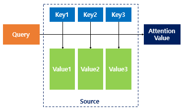
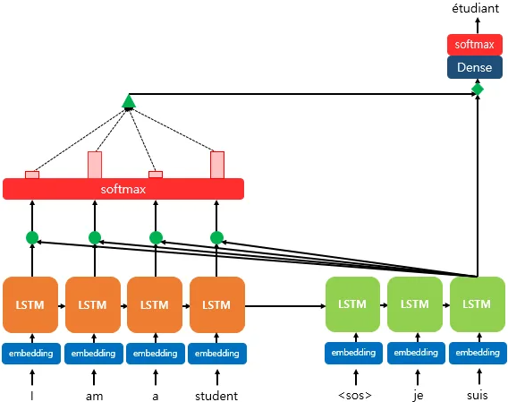
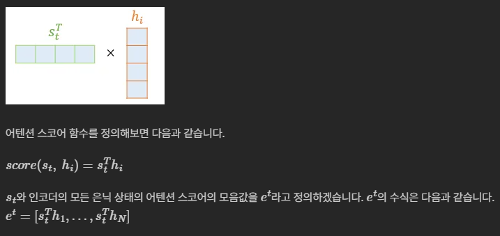

# Attention Mechanism

---

## 1. 등장 배경

Attention 이전에 **seq2seq**이라는 모델이 존재함.

* **seq2seq** : 모든 정보를 고정 크기 벡터 하나에 압축 → **정보 손실**

  * RNN이라 시퀀스가 길어지면 학습도 어려움 (= 기울기 소실)

여기서 **Attention**이 등장함.

* **Attention** : 고정 벡터를 거치지 말고, 매 시점 **원본 전체를 참조**하자.

  * 단, 균등하게가 아니라 **관련 있는 부분에 집중**

---

## 2. 동작 방식

시퀀스(순서가 있는 데이터 나열) 내 각 토큰이, 자신에게 중요한 다른 토큰의 정보를 **가중합**해서 가져옴.
이를 위해, 각 토큰 임베딩에서 아래의 세 가지 벡터(**Q, K, V**)를 만듦.





|벡터|의미|대응되는 상태|
|-|-|-|
|**Q** (Query)|나는 무엇을 찾는가|t 시점의 디코더 셀에서의 은닉 상태|
|**K** (Key)|나는 무엇을 갖고 있는가 (검색 대상 역할)|모든 시점의 인코더 셀의 은닉 상태들|
|**V** (Value)|실제로 가져올 정보|모든 시점의 인코더 셀의 은닉 상태들|


* **Self-Attention** : Q, K, V가 같은 시퀀스
* **Cross-Attention** : Q는 A에서, K/V는 B에서

---

## 3. 계보

||기록 크기|비용|정보 손실|
|-|-|-|-|
|**RNN seq2seq**|고정|O(N)|있음 (기록을 다 못함)|
|**Transformer**|없음 (요약 X)|O(N²)|없음 (원본을 봄)|
|**Mamba**|고정 + 선택적|O(N)|선택이 틀리면 손실|

---

## 4. Dot-Product Attention

* 어텐션은 다양한 종류가 있는데, 그중에서도 **가장 수식적으로 이해하기 쉽게** 수식을 적용한 어텐션임
* seq2seq의 메커니즘 자체는 거의 유사하나, 주로 **중간 수식의 차이**가 핵심임



### [seq2seq] (원래 있던 것)

* 주황 LSTM (인코더) → 초록 LSTM (디코더)

  * *LSTM : 기억을 오래 유지하는 RNN*

### [Attention] 새로 끼워 넣은 것

#### ① 초록 원 4개 ⇒ 어텐션 스코어 구하기

* 내적 지점: **인코더 각 은닉 상태 × 디코더 현재 상태**
* 인코더의 은닉 상태를 `h_i`, 디코더의 은닉 상태를 `s_t`, t번째 단어 예측을 위한 어텐션 값을 `a_t`로 가정

|기호|무엇|인덱스 의미|
|-|-|-|
|`h_i`|인코더 은닉 상태|i = 인코더 안의 위치|
|`s_t`|디코더 은닉 상태|t = 디코더의 시점 (지금 몇 번째 단어를 뱉는 중인가)|



* 위 그림을 보면, 가로 4칸 × 세로 4칸을 입력으로 받았는데 **모든 어텐션 스코어가 스칼라(1×1)** 라는 점
* 실제 계산 자체도 가로칸과 세로칸을 하나씩 짝지어 곱하고 전부 더함
* **이제 여기서, Transformer는 행렬 하나로 한 번에 계산함**

#### ② 빨간 직사각형 ⇒ softmax 함수를 통해 어텐션 분포(Distribution) 구하기

* `e_t`에 소프트맥스 함수를 적용하여, 모든 값을 합하면 1이 되는 확률 분포를 얻어냄.
이를 **어텐션 분포**라고 하고, 각각의 값은 **어텐션 가중치**라고 함.
* ex) 소프트맥스 함수를 적용하여 얻은 출력값인 I, am, a, student의 어텐션 가중치를 각각
0.1, 0.4, 0.1, 0.4라고 할 때, 이들의 합은 1임.
각 인코더의 은닉 상태에서의 어텐션 가중치의 크기를 직사각형의 크기로 시각화함.
즉, 어텐션 가중치가 클수록 직사각형이 큼.

```
αᵗ = softmax(eᵗ)
```

#### ③ 초록 삼각형 ⇒ 각 인코더의 어텐션 가중치와 은닉 상태를 가중합하여 어텐션 값(Value) 구하기

* 지금까지 준비해온 정보들을 하나로 합치는 단계
* 어텐션의 최종 결과값을 얻기 위해 각 인코더의 은닉 상태와 어텐션 가중치 값들을 곱하고,
최종적으로 모두 더함 (가중합 진행)

```
a_t = Σ αᵢ hᵢ
```

### [출력층] (원래 있던 것)

* Dense → softmax → **étudiant**

