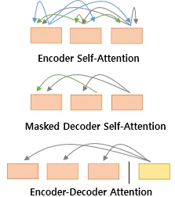
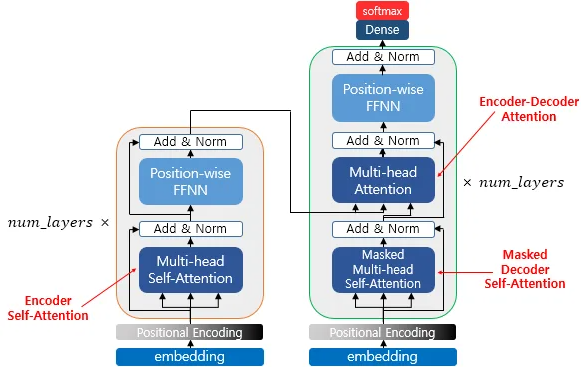
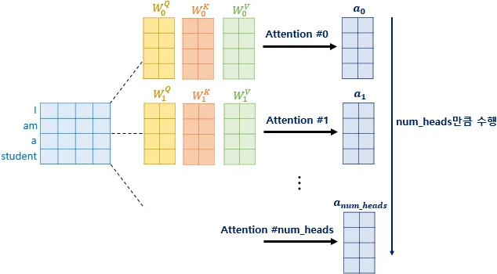
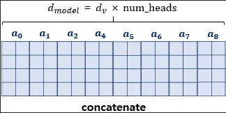
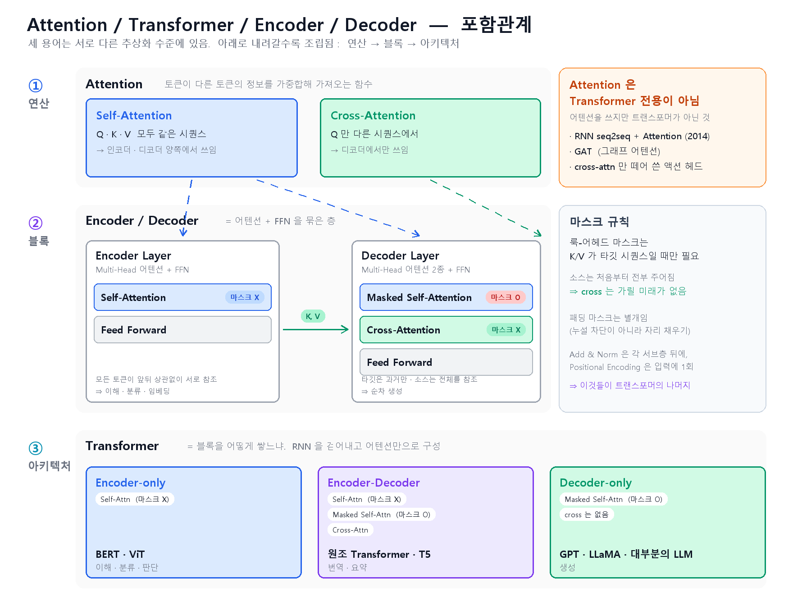

# Transformer

---

## 1. 트랜스포머의 주요 하이퍼파라미터

* **d_model**

  * 트랜스포머의 인코더와 디코더에서의 정해진 입력과 출력의 크기를 의미함.
임베딩 벡터의 차원 또한 이 값이며, 각 인코더와 디코더가 다음 층의 인코더와 디코더로 값을 보낼 때에도 이 차원을 유지함
* **num_layers**

  * 트랜스포머에서 하나의 인코더와 디코더를 층으로 생각하였을 때,
트랜스포머 모델에서 인코더와 디코더가 총 몇 층으로 구성되었는지를 의미함
* **num_heads**

  * 트랜스포머에서는 어텐션을 사용할 때, 한 번 하는 것보다 여러 개로 분할해서 병렬로 어텐션을 수행하고
결과값을 다시 하나로 합치는 방식을 택함. 이때 이 **병렬의 개수**를 의미함
* **d_ff**

  * 트랜스포머 내부에는 피드 포워드 신경망이 존재하며, 해당 신경망의 **은닉층의 크기**를 의미함.
피드 포워드 신경망의 입력층과 출력층의 크기는 `d_model` 임

---

## 2. 세 가지의 어텐션

> 출처: 유원준·안상준, [딥 러닝을 이용한 자연어 처리 입문](https://wikidocs.net/book/2155) — 트랜스포머

|어텐션|Q / K / V 출처|위치|
|-|-|-|
|**인코더 셀프 어텐션**|Query = Key = Value|인코더|
|**디코더 마스크드 셀프 어텐션**|Query = Key = Value|디코더|
|**인코더-디코더 어텐션 (= Cross)**|Query : 디코더 벡터 / Key = Value : 인코더 벡터|디코더|

* 인코더-디코더 어텐션은 Query가 디코더의 벡터인 반면에 Key-Value가 인코더의 벡터이므로
셀프 어텐션이라 부르지 않음 ⇒ **크로스 어텐션**
* 이때 Query, Key 등이 "같다"는 것은 **벡터의 값이 같다는 뜻이 아니라 벡터의 출처가 같다**는 뜻이므로 주의해야 함

> 출처: 유원준·안상준, [딥 러닝을 이용한 자연어 처리 입문](https://wikidocs.net/book/2155) — 트랜스포머

* 위 그림은 트랜스포머의 아키텍처에서 세 가지의 어텐션이 각각 어디에서 이뤄지는지 보여줌
* 세 개의 어텐션에 추가적으로 '멀티 헤드'라는 이름이 붙어 있음
⇒ 트랜스포머가 어텐션을 **병렬적으로 수행하는 방법**을 의미함

### Cross-Attention 짚어보기

* LLM 본체, 최신 VLM에서는 밀려난 추세임을 알 수 있음
⇒ OpenVLA 논문이 이 전환을 직접 서술함
* 반면, **고정 개수 쿼리로 가변 정보를 요약하는 자리**에는 아직 남아있음

또한, Self-Attention은 출력 개수가 입력을 따라감

* 입력이 몇 개든 출력은 정해진 개수가 필요하면 cross 함
* **왜 cross인가?** ⇒ 출력 개수를 고정하기 위해서임. 규칙은 **출력 개수 = 항상 Q의 개수**
  * self로 하면 in 5개 → out 5개가 되어, 관측이 늘면 출력도 늘어나 무엇이 액션인지 정할 수 없음
  * cross로 하면 Q 10개(고정) / K, V는 관측 몇 개든 상관없이 out은 항상 10개가 됨
  * self + 학습 가능 쿼리 토큰을 앞에 붙이면 흉내는 가능함 (ViT의 CLS 방식)이지만, 그래도 cross를 쓰는 이유는 의도가 구조에 그대로 드러나고 연산량도 적기 때문임 (`(10+5)² = 225` vs `10×5 = 50`)
  * ex) SUREFlow MGAD에서는 Q = 액션 쿼리 10개 / K, V = 멀티모달 토큰으로 두어 out 10개(7차원 액션)를 얻음

---

## 3. 멀티 헤드 어텐션

* **등장 배경** : 한 번의 어텐션을 하는 것보다 여러 번의 어텐션을 병렬로 사용하는 것이 더 효과적이라 판단함
* **효과** : 다른 시각으로 정보들을 수집하는 게 가능해짐

> 출처: 유원준·안상준, [딥 러닝을 이용한 자연어 처리 입문](https://wikidocs.net/book/2155) — 트랜스포머

* 먼저 위와 같이 `d_model`을 `num_heads`로 쪼갬
* `num_heads`개의 병렬 어텐션이 독립적으로 이루어지는데,
이때 각각의 어텐션 값 행렬을 **어텐션 헤드**라고 부름
* 또한 가중치 행렬인 `W^Q`, `W^K`, `W^V`의 값은 8개의 어텐션 헤드마다 전부 다름

> 출처: 유원준·안상준, [딥 러닝을 이용한 자연어 처리 입문](https://wikidocs.net/book/2155) — 트랜스포머

* 병렬 어텐션을 모두 수행했다면, 모든 어텐션 헤드를 연결함
* 모두 연결된 어텐션 헤드 행렬의 크기는 `(seq_len, d_model)`가 됨
* 마지막으로 `W_Output`을 곱해 섞음

⇒ 차원도 연산량도 늘어나지 않는데, 헤드마다 다른 관계를 포착하는 게 가능하다는 게 장점임

* **경량화와의 연결 : head pruning** — "공짜로 다양성을 얻는다"고 했지만, 얻은 다양성이 다 쓸모 있진 않음. 학습된 헤드 중 일부는 중복이라 제거해도 성능이 거의 유지된다는 연구 계열이 존재함 (차후에 다룰 주제)

---

## 4. Add & Norm

* **잔차 연결 (Residual Connection)**

  * `x + Sublayer(x)`
  * ResNet의 것과 동일. 기울기 흐름 확보
  * **입출력 차원이 같아야 성립** (그래서 `d_model`이 계속 유지됨)
* **층 정규화 (Layer Normalization)**

  * `LayerNorm`
  * 샘플 하나 안에서 정규화. 배치 크기와 무관
  * BatchNorm과 **정규화 축만 다름**
  * 트랜스포머는 LayerNorm을 사용하고 BatchNorm은 쓰지 않음
(시퀀스 길이가 다르고, 추론 시 배치 1이 될 수 있어서)

---

## 5. 룩-어헤드 마스크 (Look-ahead Mask)

RNN과 트랜스포머 둘 다 미래를 못 봄. 하지만 그 이유에 차이가 있음.

|모델|미래를 못 보는 이유|
|-|-|
|**RNN**|구조상 저절로. 순차 처리라 물리적으로 불가능함|
|**Transformer**|구조상 볼 수는 있지만, 일부러 가려야 함|

---

## 6. 용어의 층위 — Attention / Transformer / Encoder / Decoder

네 용어는 서로 다른 추상화 수준에 있음. 하나의 포함관계로 세우려 하면 꼬임.

|용어|무엇인가|수준|
|-|-|-|
|**Attention**|연산 (operation)|함수 하나|
|**Encoder / Decoder**|역할 (role)|블록 / 스택|
|**Transformer**|아키텍처 (architecture)|모델 전체|

* 특히 **인코더/디코더는 트랜스포머의 하위 개념이 아님**
  * 5장의 seq2seq이 RNN인데도 인코더-디코더 구조였음 ⇒ 트랜스포머보다 먼저 있었고, 독립된 축임

> 위 그림은 외부 인용이 아니라 이 문서를 위해 Claude로 생성한 개념도임

* 위 그림은 세 수준을 가로 밴드로 쌓은 것임. 아래로 내려갈수록 조립됨
  * 점선 화살표가 Self-Attention에서 인코더와 디코더 **양쪽으로** 내려감
⇒ "self = 인코더, cross = 디코더"가 아님. 디코더도 self를 씀
  * Masked Self-Attention을 Self와 같은 파란색으로 둔 이유
⇒ 마스크가 붙어도 여전히 셀프 어텐션이기 때문임. 마스크는 배지로만 표시함
  * `K, V` 화살표가 cross 행으로만 들어감 ⇒ Q는 디코더 내부에서 나온다는 뜻임
  * 2절의 '세 가지 어텐션'이 이 그림의 블록 밴드에 그대로 대응됨

### Attention

* 시퀀스(순서가 있는 데이터 나열) 내 각 토큰이, 자신에게 중요한 다른 토큰의 정보를 가중합해서 가져옴.
이를 위해, 각 토큰 임베딩에서 아래의 세 가지 벡터(QKV)를 만듦
  * **Query** : 나는 무엇을 찾고 있는가
  * **Key** : 나는 무엇을 갖고 있는가 (검색 대상 역할)
  * **Value** : 실제로 가져올 정보
* Q, K, V가 같은 시퀀스에서 나오면 **Self-Attention**(자기 자신 참조),
Q는 한 시퀀스에서 K/V는 다른 시퀀스에서 나오면 **Cross-Attention**(다른 시퀀스를 참조)이라고 부름.
이 구분은 이후 인코더/디코더를 이해하는 데 중요함

### Transformer

* Attention만으로는 토큰 순서 정보가 전혀 없음. 그래서 Transformer는 아래 요소들을 결합한 전체 아키텍처를 가짐
  * **Positional Encoding** : 순서 정보를 임베딩에 더해줌
  * **Multi-Head (Self-)Attention** : 위에서 설명함
  * **FeedForward Network (FFN)** : 각 토큰 위치별로 독립적으로 적용되는 2-layer MLP
  * **Residual Connection + Normalization** : `x + Sublayer(x)` 형태로 그래디언트 소실을 방지하고,
LayerNorm으로 학습을 안정화 (4절 참고 — 트랜스포머는 BatchNorm을 쓰지 않음)

### Encoder

* 입력 시퀀스 전체를 받아 문맥이 반영된 표현으로 변환하는 부분
  * Self-Attention을 쓰되, 마스킹이 없음 ⇒ 모든 토큰이 앞뒤 상관없이 서로를 참조 가능
  * 따라서, 문장 전체를 이해하는 것에 강함 ⇒ 분류, 임베딩 추출, 검색 등에 적합
  * 대표 : **BERT** (마스킹된 토큰을 양쪽 문맥으로 예측하는 방식으로 사전 학습)

⇒ 논문에서 인코더만 쓰는 구조를 보면, 대개 '생성'이 아니라 '이해/판단'이 목적이 주를 이룸

⇒ RNN은 인코더와 디코더의 균형을 이루는 반면, CNN에서는 인코더의 비중이 압도적으로 큼

### Decoder

* 시퀀스를 한 토큰씩 순차적으로 생성하는 부분. 두 가지 핵심 장치가 있음
  * **Causal (Masked) Self-Attention** : 토큰 `i`가 자신보다 뒤에 있는 토큰을 절대 볼 수 없도록
어텐션 스코어를 `−∞`로 마스킹. 이래야 학습 때 정답을 미리 훔쳐보지 않으면서
다음 토큰 예측을 병렬로 학습할 수 있음
  * **Cross-Attention** (인코더-디코더 구조일 때만) : 디코더의 Q가 인코더가 만든 K, V를 참조
    * 이쪽에는 룩-어헤드 마스크가 걸리지 않음. 소스는 처음부터 전부 주어져 있어 가릴 미래가 없기 때문임
    * 5절의 마스크는 K/V가 **타깃 시퀀스**일 때만 필요한 것임

⇒ "지금까지 생성한 것 + 원본 입력 전체"를 보고 순서대로 생성해 나감. 현재 대부분의 프론티어 LLM이 이 구조임
