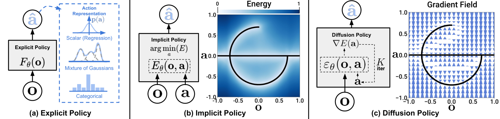

# Generative Model

---

## 1. 생성모델

- 데이터가 어떻게 생겼는지 분포를 배워서 새 샘플을 뽑아내는 모델
- VAE, GAN, Diffusion, Flow 전부 여기 속함

- 생성모델의 목표
    - 전부 동일함 ⇒ 데이터 분포 `p(x)`를 배워서 새 샘플을 뽑는 것
    - 갈리는 지점은 `p(x)`를 명시적으로 다루냐의 차이임

|계열|`p(x)`를 다루는 방식|학습 방법|
|-|-|-|
|**GAN**|안 다룸 (암묵적)|생성자 vs 판별자 적대 학습|
|**VAE**|근사|인코더-디코더 + ELBO|
|**Diffusion**|근사 (변분 하한)|노이즈 예측 회귀 (예측한 노이즈를 조금씩 뺌)|
|**Normalizing Flow**|정확히 계산|가역 변환 + 변수 변환 공식|
|**Flow Matching**|학습에는 안 씀 (확률 경로를 직접 설계)|velocity 회귀 (방향 예측해 보폭 크게 이동)|

> 출처: Lilian Weng, [What are Diffusion Models?](https://lilianweng.github.io/posts/2021-07-11-diffusion-models/) (2021)

- 위 그림은 표의 네 계열을 구조도로 나란히 놓은 것임
    - GAN은 판별자가 따로 붙어있고, VAE는 인코더-디코더로 `z`를 거치며, Flow는 가역 변환과 역변환이 쌍을 이룸
    - Diffusion만 여러 스텝을 오가는 체인 형태임 ⇒ 스텝 수가 곧 생성 비용이 되는 이유

- Flow Matching도 CNF라서 사후에 ODE로 정확한 likelihood 계산은 가능함. 학습에 쓰지 않을 뿐임

---

## 2. 왜 Diffusion과 Flow Matching이 physical AI에서 중요한가

- 생성 모델을 쓰는 목적이 다름
    - 이미지를 생성하려는 게 아니라, 정책이 액션을 뱉는 방식으로 씀
    - 즉 diffusion / flow matching ⇒ **action head**

- 로봇 액션의 세 가지 성질 ⇒ 생성 모델이 필요한 이유
    - **연속값** : 이산 토큰으로 쪼개면 정밀도 손실
    - **고차원** : 관절 N개 × 청크 H스텝을 한 번에 출력
    - **multi-modal** : 같은 관측에 정답 궤적이 여러 개

        ex) 컵을 왼쪽으로 돌아가도, 오른쪽으로 돌아가도 정답

        - 단순 회귀 → 여러 정답의 평균 → 어느 쪽으로도 못 가는 무의미한 궤적

        ⇒ 분포를 표현할 수 있는 생성 모델이 필요

> 출처: Chi et al., [Diffusion Policy: Visuomotor Policy Learning via Action Diffusion](https://arxiv.org/abs/2303.04137) (RSS 2023), Fig. 2

- 검은 곡선이 정답 액션의 집합임 (한 관측에 정답이 여러 개인 상황)
- **(a) 단순 회귀** : 액션 하나만 뱉음 ⇒ 여러 정답의 평균으로 뭉개짐
- **(c) diffusion policy** : gradient field를 따라가며 여러 mode 중 하나로 수렴함

- diffusion으로 해결됨 ⇒ 그런데 느림 (스텝 수십~수백 번)
    - 로봇은 실시간 제어 (스텝 수 = 지연 시간)
    - 적은 스텝으로 같은 품질을 내는 flow matching으로 이동
    - 다만 "diffusion = 무조건 느림"으로 굳혀서는 안 됨. DDIM, DPM-Solver 같은 샘플러를 쓰면 10~50 스텝, distillation까지 가면 1~4 스텝도 가능함. 로봇에서 flow matching을 택하는 이유 자체는 여전히 유효하지만, 논문에서 few-step diffusion을 만났을 때 헷갈리지 않으려면 이 점을 알아둬야 함

---

## 3. Diffusion

- **forward** : 진짜 데이터에 노이즈를 조금씩 섞어 완전한 노이즈로 만듦
    - 학습 대상 아님. 그냥 정해진 규칙 (noise schedule)

- **reverse** : 신경망이 "지금 이 데이터에 낀 노이즈가 뭐냐"를 예측
    - 학습 = 노이즈 예측 회귀 (단순 MSE)
    - forward와 달리 정해진 규칙으로 못 쓰는 이유 : 진짜 역방향 분포 `q(x_{t-1}|x_t)`는 데이터 분포 전체를 알아야 계산되므로 알 수 없음
    - 그래서 이것만 신경망 `p_θ(x_{t-1}|x_t)`로 근사함 ⇒ **forward는 규칙, reverse는 학습 대상**

- **생성** : 순수 노이즈에서 시작해 예측한 노이즈를 조금씩 뺌
    - 한 번에 못 빼니 여러 번 반복 ⇒ 느린 이유

- 예측 대상이 노이즈만 있는 건 아님 (parameterization)
    - `ε-prediction` : 낀 노이즈를 예측 (가장 일반적)
    - `x0-prediction` : 원본 데이터를 바로 예측
    - `v-prediction` : 둘을 섞은 형태 — 이름이 같아서 헷갈리지만 flow matching의 velocity와는 다른 개념임. diffusion의 v는 노이즈와 데이터를 섞은 예측 타깃이고, flow matching의 velocity는 확률 경로 위에서의 이동 방향-크기임

---

## 4. Flow Matching

- 실무적으로 더 넓고 빠른 선택임

- 노이즈 지점과 데이터 지점을 직선으로 이어놓음
    - `x_t = (1-t)·noise + t·data` (선형 보간)

- 그 선 위 임의의 지점에서 "어느 방향으로 얼마나 가야 하나"를 예측
    - 이 방향-크기 = **velocity field**
    - 학습 = velocity 회귀 (역시 단순 MSE)

- **왜 단순 MSE로 학습이 되는가 (Conditional Flow Matching)**
    - 먼저 용어 두 개
        - **조건부 경로** : 노이즈 한 점과 데이터 한 점을 직선으로 이은 것 (위의 선형 보간이 이것)
        - **주변(marginal) 속도장** : 그런 조건부 경로를 전부 모았을 때 나오는 평균. 샘플링에서 실제로 따라가는 건 이쪽임
    - 진짜 목표는 주변 속도장인데, 이건 모든 경로를 적분해야 하므로 계산 불가능함
    - 그런데 계산 가능한 **조건부** 속도장으로 회귀해도 gradient가 동일하다는 정리가 있음
    - 그래서 학습은 직선 하나 위에서만 일어남 ⇒ "노이즈-데이터 쌍 뽑고 → 보간점에서 방향 회귀"라는 단순 루프
    - ⇒ 이게 flow matching 논문의 핵심 기여임

- **생성** : 노이즈에서 출발해 예측한 방향으로 몇 걸음 (Euler)
    - 조건부 경로가 직선이라 회귀 대상이 단순함 (diffusion의 곡선 경로 대비)
    - 걸음 수가 적어도 됨 ⇒ 빠른 이유
    - 단, 직선인 건 어디까지나 노이즈 하나와 데이터 하나를 이은 **조건부 경로**일 뿐, 실제 샘플링 궤적은 아님. 샘플링에서 실제로 따라가는 건 학습된 **주변 속도장**이고, 이 궤적은 휘어짐. Rectified Flow의 **reflow**가 바로 이 궤적을 펴는 절차이며, 펴는 절차가 따로 필요하다는 것 자체가 원래는 곧지 않다는 뜻임

---

## 5. 둘의 관계

- 경쟁 모델이 아님. 출발점(노이즈)과 도착점(데이터)이 같음
- 다른 것은 두 가지뿐
    1. 중간 경로를 어떻게 정의하나
    2. 모델이 무엇을 예측하나 (노이즈 vs velocity)

- 노이즈가 가우시안인 일반적 경우 수학적으로 동등함이 정리됨

    ⇒ flow matching = diffusion의 대체재가 아니라
    "같은 것의 더 깔끔한 재서술 + 직선 경로라는 선택"

---

## 6. Action Head로 붙는 방식

- 관측 `o`를 조건으로 velocity를 회귀함
    - `v_θ(x_t, t, o)` ⇒ 출력은 **액션 청크** (관절 N개 × H스텝)
    - 이미지 대신 액션 시퀀스를 생성한다는 것만 다르고 구조는 동일함

> 출처: Chi et al., [Diffusion Policy: Visuomotor Policy Learning via Action Diffusion](https://arxiv.org/abs/2303.04137) (RSS 2023), Fig. 3

- 왼쪽 아래가 액션 청크의 실체임 : 노이즈 상태에서 시작해 점점 하나의 궤적으로 수렴함
- 가운데를 보면 관측을 조건으로 받아 여러 스텝의 액션을 **한 번에** 출력함 (prediction horizon)
    - 위에서 말한 "관절 N개 × H스텝을 한 번에"가 이 그림임

- 전형적인 VLA 구성
    - **백본** : 관측 `o`(이미지 + 언어 지시)를 인코딩 — VLM 또는 SSM
    - **head** : flow matching으로 액션 청크를 생성

- 이 구조를 쓰는 대표 모델
    - **π0** : VLM 백본 + flow matching action head
    - **SUREFlow** (IROS'26) : Mamba 기반 경량(179M) 백본 + residual flow matching head
    - 제목만 봐도 구조가 파싱됨 : *State-space* (= Mamba 백본) + *Uncertainty-aware* + *REsidual **Flow Matching*** (= action head) ⇒ 백본과 head를 각각 무엇으로 골랐는지가 제목에 그대로 들어있음

> 출처: Black et al., [π0: A Vision-Language-Action Flow Model for General Robot Control](https://arxiv.org/abs/2410.24164) (2024)

- π0의 구조도임
    - 왼쪽 파란 블록이 **백본** (VLM), 오른쪽 초록 블록이 **action expert** (= flow matching head)
    - head 입력에 노이즈가, 출력에 액션 청크가 붙어있음 ⇒ 노이즈에서 액션을 생성하는 구조
- 백본과 head가 물리적으로 분리된 블록이라는 게 눈에 보임 ⇒ 백본만 Mamba로 갈아끼우면 SUREFlow 구성이 됨
