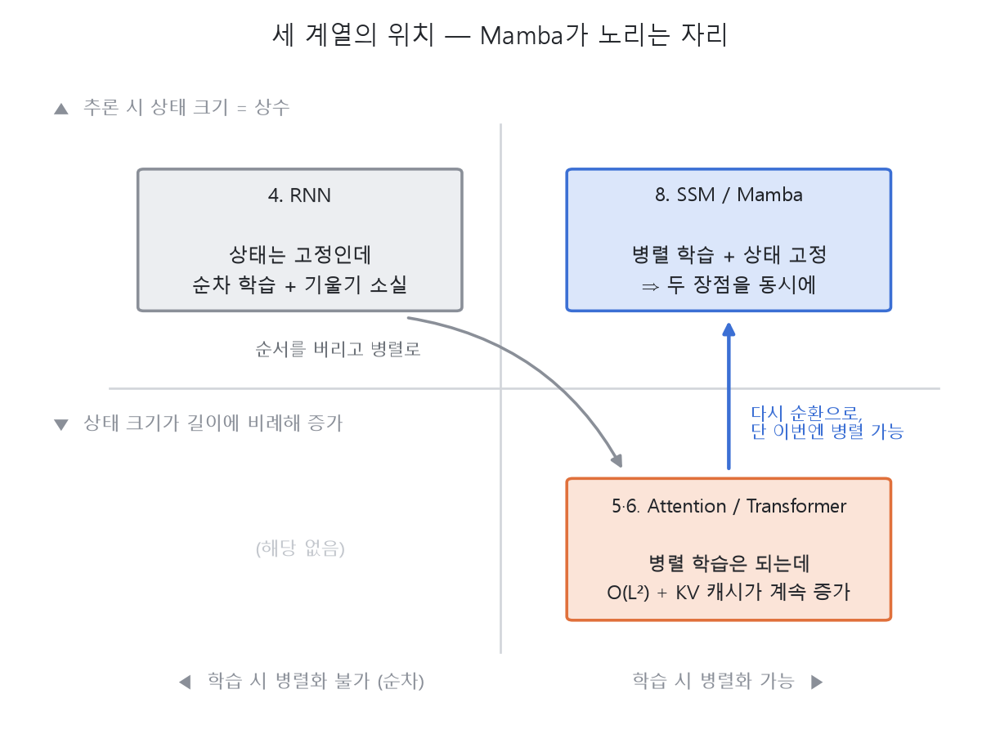
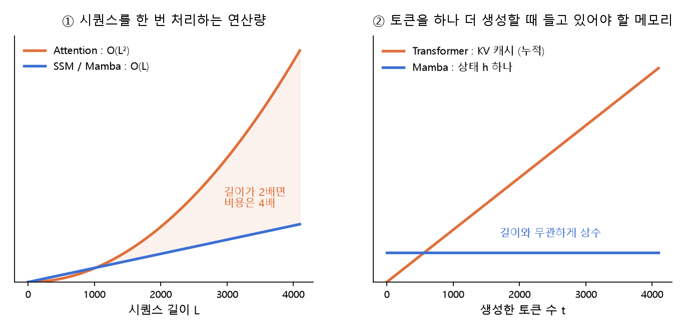
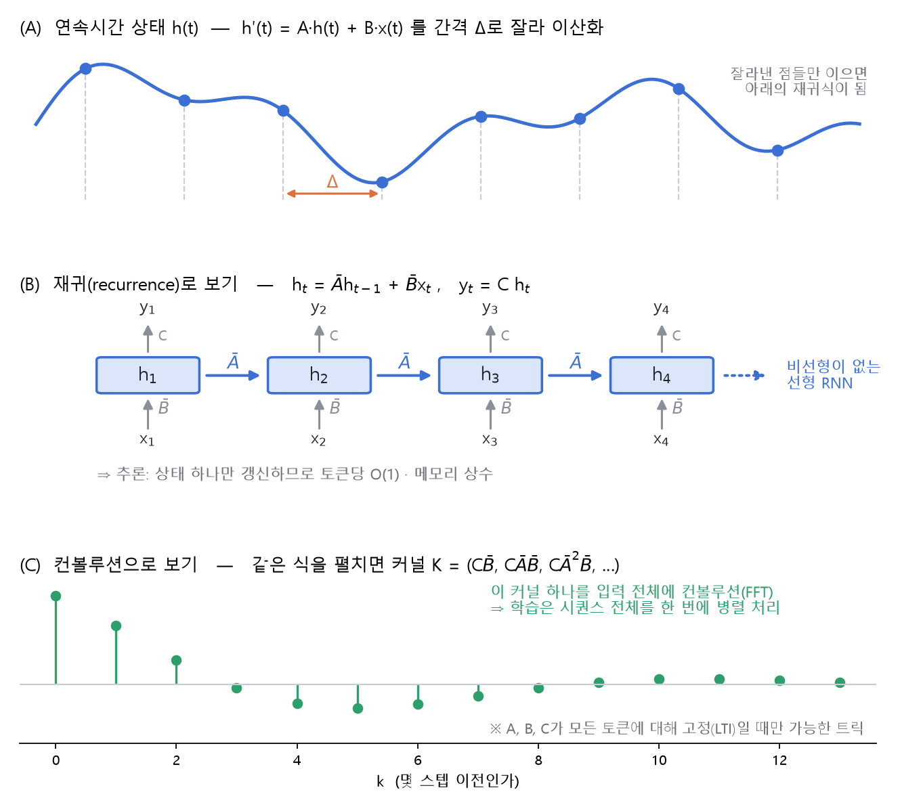
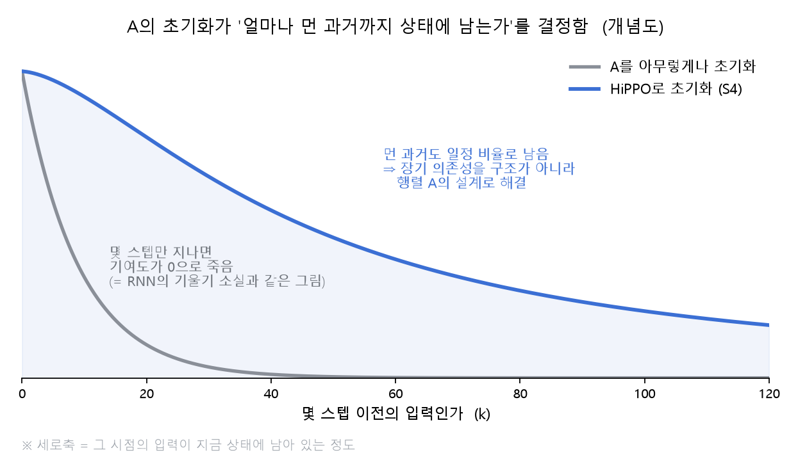
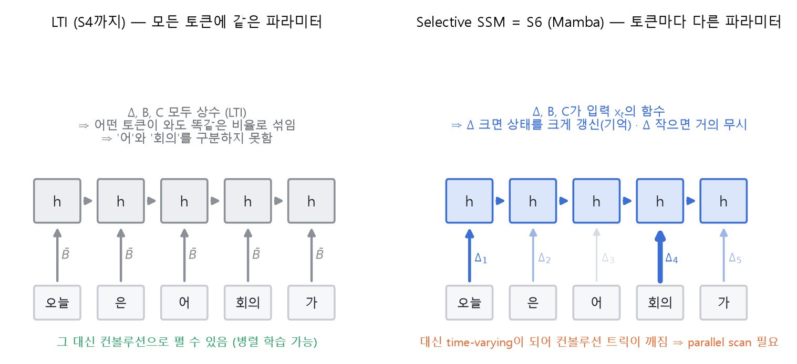
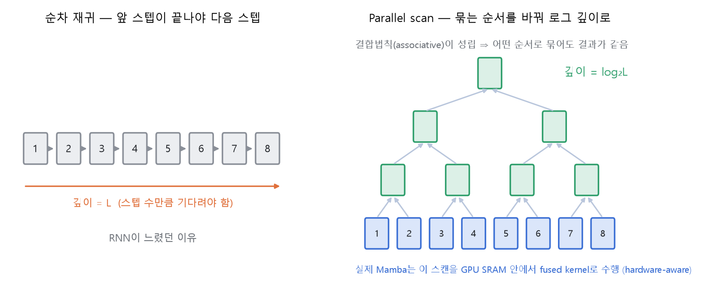
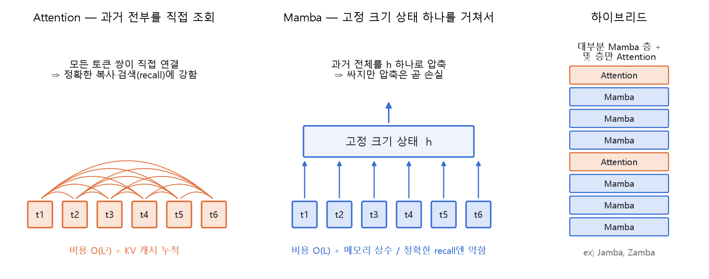

# SSM & Mamba

> 이 장의 그림은 논문 원본이 아니라, 이 문서를 위해 Claude로 생성한 개념도임

---

- 지금까지의 흐름을 한 줄로 놓으면 이 장이 왜 마지막인지가 보임

    **4. RNN** (순환은 되는데 순차적 + 기울기 소실)
    → **5. Attention / 6. Transformer** (병렬은 되는데 O(L²))
    → **7. Generative Model**
    → **8. SSM / Mamba** (다시 순환으로, 근데 이번엔 병렬됨)

- 즉 4장에서 버렸던 '순환'을 다시 주워오는 장임. 단, RNN이 느렸던 이유였던 **순차 학습**을 제거한 채로

- 먼저 이름 관계부터 정리하고 들어가야 함. **SSM은 메커니즘 계열이고, Mamba는 그 계열로 만든 구체적 아키텍처**임

    ⇒ **Attention : Transformer = SSM : Mamba** 와 같은 관계임 (5장과 6장을 나눈 이유와 동일)



- 가로축은 **학습을 병렬로 돌릴 수 있는가**, 세로축은 **추론할 때 들고 있어야 할 상태가 고정 크기인가**임
- RNN과 Transformer는 서로 다른 칸에 하나씩 들어가 있음 ⇒ 각자 하나씩만 가짐
- SSM / Mamba가 노리는 자리는 **오른쪽 위 칸** — 두 성질을 동시에 갖는 것


---

## 1. 왜 또 순환인가

- Transformer가 남긴 청구서는 두 장임

    1. **학습** : 토큰 쌍 전부에 대해 어텐션 스코어를 계산 ⇒ 길이 L에 대해 **O(L²)**
    2. **추론** : 생성한 토큰마다 K, V를 캐시에 쌓아둠 ⇒ **KV 캐시가 길이에 비례해 무한정 증가**

- 2번이 특히 실전에서 아픔
    - 컨텍스트가 길어질수록 캐시가 GPU 메모리를 잠식함
    - 토큰 하나를 생성할 때마다 그 캐시 전체를 다시 읽어야 함 ⇒ 병목이 연산이 아니라 **메모리 대역폭**이 됨



- 왼쪽이 학습 쪽 청구서임 : 길이가 2배가 되면 어텐션 비용은 4배가 됨 (파란 선은 길이에 비례할 뿐임)
- 오른쪽이 추론 쪽 청구서임 : 주황은 계속 늘어나는 KV 캐시, 파랑은 길이와 무관한 상수 크기의 상태 `h`
- 4장의 RNN은 사실 오른쪽 그림에서 **이미 파란 선**이었음
    - 상태 `h` 하나만 갱신하므로 추론은 원래 토큰당 O(1) · 메모리 상수임
    - 문제는 반대쪽이었음 ⇒ **학습이 순차적**(앞 스텝이 끝나야 다음 스텝)이고 **기울기 소실**이 있었음

- 그래서 목표가 명확해짐

    ⇒ **학습은 Transformer처럼 병렬로, 추론은 RNN처럼 상수 크기로**


---

## 2. SSM 기본형

- SSM(State Space Model)은 딥러닝이 아니라 **제어이론**에서 온 형식임
- 시스템의 상태 `h`가 시간에 따라 어떻게 변하는지를 미분방정식으로 적은 것

    ```
    h′(t) = A·h(t) + B·x(t)     (상태가 어떻게 갱신되는가)
    y(t)  = C·h(t)              (상태에서 무엇을 꺼내 보는가)
    ```

    - `A` : 이전 상태를 얼마나 유지/감쇠시킬지 ⇒ 기억의 성질을 결정
    - `B` : 새 입력을 상태에 얼마나 넣을지
    - `C` : 상태를 출력으로 어떻게 읽을지

- 이 식은 연속시간이므로, 토큰 단위로 쓰려면 간격 `Δ`로 잘라 **이산화**해야 함
    - `Ā = exp(ΔA)`, `B̄ ≈ (ΔA)⁻¹(exp(ΔA) − I)·ΔB` 형태로 변환됨 (ZOH)
    - 결과 : `h_t = Ā·h_(t−1) + B̄·x_t` , `y_t = C·h_t`

    ⇒ 형태를 보면 **비선형이 하나도 없는 RNN**임. 그래서 '선형 RNN'이라고 부름



- (A) 연속시간 상태를 `Δ` 간격으로 잘라 점만 남긴 것이 이산 재귀식임
- (B) **재귀(recurrence)로 보는 관점** : 상태 하나를 갱신해 나감 ⇒ 추론에 유리 (토큰당 O(1) · 메모리 상수)
- (C) **컨볼루션으로 보는 관점** : 같은 식을 그냥 펼치면
`h_t = B̄x_t + ĀB̄x_(t−1) + Ā²B̄x_(t−2) + …` 이므로,
출력은 커널 `K = (CB̄, CĀB̄, CĀ²B̄, …)` 와 입력 시퀀스의 **컨볼루션 한 번**이 됨
    - 커널을 미리 만들어 FFT로 돌리면 시퀀스 전체를 **한 번에 병렬 처리**할 수 있음

- 이 두 관점이 **같은 파라미터에 대한 두 가지 계산 방법**이라는 게 SSM의 핵심임

    ⇒ **학습할 땐 컨볼루션 모드(병렬), 추론할 땐 재귀 모드(상수 메모리)** 로 갈아탐

### LTI가 뭔가

- 위의 컨볼루션 트릭은 아무 시스템에서나 되는 게 아니고, 시스템이 **LTI**일 때만 성립함
- **LTI = Linear Time-Invariant (선형 시불변)** — 두 조건이 붙어 있는 말임

|조건|의미|여기서는|
|-|-|-|
|**Linear** (선형)|상태와 입력에 대해 1차식. 두 입력을 같이 넣은 결과 = 각각 넣은 결과의 합 (중첩)|상태 갱신 안에 `tanh` 같은 비선형이 없음|
|**Time-Invariant** (시불변)|시스템의 성질이 시간에 따라 변하지 않음. 입력을 k스텝 늦게 넣으면 출력도 정확히 k스텝 늦어질 뿐 모양은 같음|`A, B, C, Δ`가 **모든 토큰에 대해 같은 값**|

- 왜 이게 필요하냐면, 이 두 조건이 동시에 성립해야 시스템 전체를 **커널 하나와의 컨볼루션**으로 접을 수 있기 때문임

    (신호처리에서 "LTI 시스템의 출력 = 입력과 임펄스 응답의 컨볼루션"이라고 부르는 그 성질임)

    - 위치마다 커널이 달라지면 컨볼루션 한 번으로 표현할 수 없음 ⇒ 병렬 학습이 깨짐

- 대신 시불변이 강제하는 대가가 있음

    ⇒ **언제 어떤 토큰이 들어오든 똑같은 방식으로 반응함**. 즉 내용을 보고 골라 담는 게 불가능함

- 미리 말해두면, **Mamba는 Linear는 유지하고 Time-Invariant만 버리는 선택**임 (4절)


---

## 3. S4와 HiPPO — 장기 의존성을 A의 설계로

- 선형 재귀에서 k스텝 전 입력이 지금 상태에 남아 있는 정도는 `Āᵏ`가 결정함
    - `A`를 아무렇게나 초기화하면 `Āᵏ`가 지수적으로 0으로 죽음
    - 이건 4장 RNN의 기울기 소실과 **정확히 같은 그림**임

- **HiPPO**는 이 `A`를 특정한 형태로 잡는 방법론임
    - 아이디어 : 과거 입력 전체를 **직교 다항식 기저로 근사(압축)** 해서 상태에 담도록 유도함
    - 그 압축을 온라인으로 최적 수행하는 행렬 `A`가 수학적으로 유도됨 ⇒ 이 값으로 초기화



- 세로축은 그 시점의 입력이 **지금 상태에 얼마나 남아 있는가**임
- 회색은 임의 초기화 ⇒ 몇 스텝만 지나면 기여도가 0으로 죽어 장기 의존성이 사라짐
- 파랑은 HiPPO 초기화 ⇒ 먼 과거도 일정 비율로 남음

- **S4** (Structured State Space Sequence model)는 여기에 두 가지를 더한 모델임
    1. HiPPO 초기화
    2. `A`를 **구조화**(대각 + 저계수, 이후 S4D는 그냥 대각)해서 커널 계산을 효율적으로 만듦

- 핵심은 접근 방식임

    ⇒ LSTM처럼 **게이트라는 구조를 덧붙여** 장기 기억을 푼 게 아니라,
    **행렬 A를 어떻게 설계할 것인가**로 푼 것임

- 이 시점에서 SSM 계열은 Long Range Arena 같은 초장문 벤치마크에서 Transformer를 크게 앞섰지만,
정작 **언어 모델링에서는 밀렸음**. 그 이유가 다음 절임


---

## 4. Mamba = Selective SSM

- S4까지의 SSM은 LTI였음 ⇒ **모든 토큰을 같은 비율로 섞어 담음**
    - 언어에서는 이게 치명적임. `"어"`, `"음"` 같은 토큰과 `"회의"` 같은 토큰을 구분하지 못함
    - "이 문장에서 X만 기억하고 나머지는 흘려라" 같은 **내용 기반 선택**이 구조적으로 불가능함
    - 반면 Attention은 QK 내적으로 매 토큰마다 다르게 봄 ⇒ 언어에서 강했던 이유

- **Mamba의 해법** : `Δ`, `B`, `C`를 **입력 `x_t`의 함수**로 만듦 (선형 사영으로 토큰마다 계산)
    - 이걸 **selective SSM**, 논문 표기로 **S6**라고 부름
    - `A` 자체는 입력에 의존하지 않지만 `Ā = exp(ΔA)`이므로, `Δ`를 통해 사실상 토큰마다 달라짐



- 왼쪽이 LTI(S4까지)임 : 모든 화살표가 같은 굵기 ⇒ 어떤 토큰이 와도 같은 비율로 상태에 섞임
- 오른쪽이 selective SSM임 : `Δ`가 토큰마다 다름
    - **Δ가 크면** 현재 입력을 상태에 크게 반영 (기억해라)
    - **Δ가 작으면** 상태를 거의 그대로 유지 (무시해라)

    ⇒ 사실상 RNN의 **forget gate와 같은 역할**을 `Δ`가 함. LSTM이 게이트로 하던 일을 이산화 스텝 크기로 하는 셈임

- 문제는 이걸 하는 순간 **Time-Invariant가 깨진다는 것**임 (= time-varying)
    - 커널이 위치마다 달라짐 ⇒ 2절의 컨볼루션 트릭 사망 ⇒ 병렬 학습 불가

- 여기서 Mamba가 꺼내는 카드가 **parallel scan**임
    - Time-Invariant는 버렸지만 **Linear는 그대로 유지**했다는 게 결정적임
    - 선형 재귀는 **결합법칙(associative)** 이 성립함 ⇒ 앞에서부터 순서대로 접지 않고 아무렇게나 묶어도 결과가 같음



- 왼쪽처럼 순서대로 접으면 깊이가 L이 되어 RNN처럼 느려짐
- 오른쪽처럼 둘씩 묶어 올라가면 깊이가 **log₂L**로 줄어듦 ⇒ 병렬 학습이 되살아남
- Mamba는 여기에 **hardware-aware** 구현을 얹음
    - 커진 상태를 느린 HBM에 쓰지 않고 **GPU SRAM 안에서 fused kernel로 처리**
    - 역전파용 중간 상태는 저장하지 않고 **재계산(recomputation)** ⇒ 메모리를 아끼면서 실제 속도를 확보

- **Mamba 블록**의 생김새 (Transformer 블록 자리에 그대로 들어감)

    ```
    입력 → 선형 사영 (2갈래)
         ├─ 짧은 causal depthwise conv1d → SiLU → selective SSM ─┐
         └─ SiLU ─────────────────────────────(게이트)────────── × → 선형 사영 → 출력
    ```

    - Transformer가 `Attention + FFN` 두 덩어리를 쌓는 것과 달리 **한 덩어리로 합쳐진 형태**임
    - 이 블록만 N개 쌓으면 Mamba 모델이 됨. 위치 인코딩은 없음 (재귀 구조 자체에 순서가 들어있기 때문)

- 이후 **Mamba-2 (SSD)** 에서 selective SSM의 한 부류가 **linear attention과 동치**임이 정리됨
    - 재귀를 행렬(semiseparable matrix) 형태로 재구성해 행렬곱 하드웨어를 더 잘 쓰게 만듦

    ⇒ SSM과 Attention이 완전히 다른 종족이 아니라 **같은 것의 두 표현**이라는 게 밝혀진 지점임

- 정리하면

|이름|정체|
|-|-|
|**SSM**|선형 상태공간 재귀라는 **메커니즘 계열** (S4, S4D, S5 … 포함)|
|**Selective SSM (S6)**|`Δ, B, C`를 입력 의존으로 만든 **SSM의 한 종류**|
|**Mamba**|S6 + 게이팅 + conv1d를 묶은 **구체적 블록/아키텍처**|


---

## 5. Attention vs Mamba



- 왼쪽은 Attention임 : 모든 토큰 쌍이 직접 연결됨 ⇒ 과거를 **원본 그대로** 조회할 수 있음
- 가운데는 Mamba임 : 모든 과거가 **고정 크기 상태 `h` 하나**를 통과함 ⇒ 싸지만 **압축은 곧 손실**임
    - 그래서 Mamba의 약점이 명확함 ⇒ **정확한 복사·검색(recall)**
    - ex) 앞에 나온 특정 문자열을 그대로 다시 출력하기, 긴 문서에서 특정 값을 정확히 찾아오기

|비교 항목|Attention / Transformer|Mamba|
|-|-|-|
|학습 계산량|O(L²)|O(L) (parallel scan)|
|추론, 토큰당|캐시 전체 조회 ⇒ 길이에 비례|**O(1)**|
|추론 메모리|KV 캐시가 계속 누적|**상수** (상태 `h` 하나)|
|순서 정보|positional encoding 필요|재귀 구조에 내장 (불필요)|
|내용 기반 선택|QK 내적으로 매 토큰마다|`Δ, B, C`의 입력 의존|
|정확한 recall / 복사|**강함**|약함 (압축 손실)|

- 그래서 현실적인 답이 **하이브리드**임 (오른쪽 그림)
    - 대부분의 층은 Mamba로, **몇 층만 Attention**으로 섞음
    - 어텐션 층이 조금만 들어가도 recall 성능이 크게 회복된다는 게 경험적으로 확인됨
    - ex) **Jamba**, **Zamba** 등

- 따라서 "Mamba가 Transformer를 대체했다"는 서술은 정확하지 않음

    ⇒ **긴 시퀀스를 싸게 흘려보내는 자리**는 Mamba가 가져가고,
    **정확히 집어내야 하는 자리**는 Attention이 남는 쪽으로 정리되는 중임


---

## 6. VLA 백본으로서의 Mamba

- 로봇에서 이 트레이드오프가 어떻게 읽히는지가 이 장의 마지막임

- 로봇 정책의 제약 조건
    - **실시간 제어 주기** : 수십 Hz로 액션을 계속 내보내야 함 ⇒ 추론 지연이 곧 제어 실패
    - **온보드 자원** : 서버 GPU가 아니라 로봇에 실린 작은 GPU
    - **관측이 계속 쌓임** : 카메라 스트림은 끝나지 않음

    ⇒ 비용이 길이에 비례해 늘어나는 구조는 **시간이 지날수록 느려지는 정책**이 된다는 뜻임

- Mamba가 정확히 이 지점에 들어맞음
    - 토큰당 **상수 시간 · 상수 메모리** ⇒ 얼마나 오래 돌든 제어 주기가 유지됨
    - 파라미터를 작게 가져가면서도 긴 문맥을 흘려보낼 수 있음

- 7장 마지막에서 봤던 구조를 다시 꺼내면 그대로 이어짐

    - **π0** : VLM 백본 + flow matching action head
    - **SUREFlow** (IROS'26) : **Mamba 기반 경량(179M) 백본** + residual flow matching head

    ⇒ 7장 [Generative_Model.md](../7.Generative_Model/Generative_Model.md)의 π0 구조도(image_4)에서
    왼쪽 파란 블록(백본)만 Mamba로 갈아끼운 것이 SUREFlow임. head는 건드리지 않음

- 다만 5절의 트레이드오프는 로봇에서도 그대로 적용됨
    - 장면 안의 특정 객체나 지시문을 **정확히 참조**해야 하는 작업이라면 어텐션 층을 섞는 편이 현실적임
    - 즉 "Mamba 백본"은 무조건적인 상위 선택이 아니라 **실시간성과 recall 사이의 선택**임


---

## 7. 전체 정리

|장|핵심 질문|그 장의 답|
|-|-|-|
|**4. RNN**|과거를 어떻게 들고 가나|상태 `h` 하나에 순차적으로 누적|
|**5·6. Attention / Transformer**|과거 중 무엇이 중요한가|전부 보고 가중합 (대신 O(L²))|
|**7. Generative Model**|어떻게 새로 만들어내나|노이즈에서 데이터로 (diffusion / flow matching)|
|**8. SSM / Mamba**|둘 다 가질 수는 없나|선형 재귀 + 입력 의존 파라미터 + parallel scan|

- 8장을 한 문장으로 줄이면

    ⇒ **RNN의 상수 메모리와 Transformer의 병렬 학습을 동시에 갖기 위해,
    비선형을 포기하고(Linear) 시불변만 버린(Time-varying) 구조**
