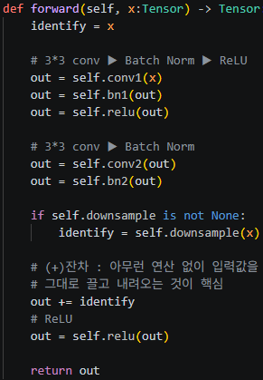
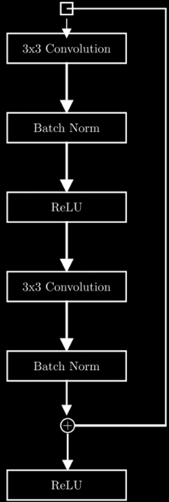
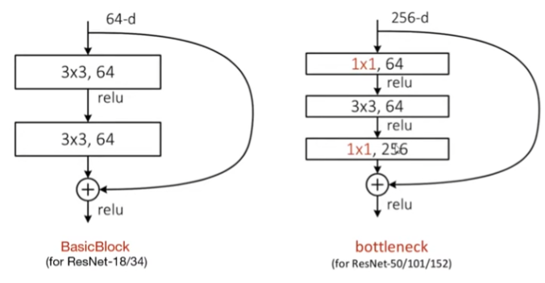

\## (VGG)


\- CNN의 기본 형태(Conv → ReLU → Pool) 구조를 반복한 형태다 정도만 인지

&#x20;   

&#x20;   (BN이 없고 잔차를 바로 더해줄 직통길이 없음)

&#x20;   


\## Residual Network (=ResNet)


등장 배경 : 네트워크는 깊어지는데(hidden 층이 많아지는데) 성능이 떨어지는 현상 발생


개념 : CNN의 대표 모델 


\*\*ANN(인공신경망) ⊃ 심층신경망(DNN) ⊃ 합성곱 신경망(CNN) ⊃ 잔여 신경망(ResNet)\*\*


\- ANN(Artificial Neural Network) : 모든 신경망의 최상위 개념

\- DNN(Deep ‘’ ) : 은닉층이 여러 개 쌓인 ANN

\- CNN(Convolutional ‘’ ) : 공간 특징(이미지 등) 추출 연산층을 사용하는 DNN

\- ResNet(Residual Network) : CNN의 한 종류로, 잔차 학습 구조를 통해 극도로 깊은 층을 안정적으로 학습시킨 모델


\- MLP (Multi-Layer Perceptron / 다층 퍼센트론) : “입력층 - 은닉층 - 출력층” 으로 구성된 다층 신경망

\- 퍼셉트론 : 생물학적 관점의 뉴런(하나의 노드)이 컴퓨터에서는 퍼셉트론이라 칭함


크게 두가지 축으로 나뉨


\- BasicBlock

\- bottleneck


\## BasicBlock (기본)


\- ResNet - 18 / 34

\- ResNet 블록은 네트워크가 수행해야 할 학습 작업을 두 가지로 분담함

&#x20;   - 첫째, 기존 입력 신호를 훼손 없이 그대로 유지하는 것 ⇒ \*\*Identity (정보 보존)\*\*

&#x20;   - 둘째, 목표 출력을 만들기 위해 기존 입력에 무엇(어떤 특징/변화량)을 더해야 하는지 파악하는 것

&#x20;       

&#x20;       ⇒ \*\*Residual (잔차 학습)\*\*

&#x20;       





\- 위의 조건문인 self.downsample이 지름길 경로의 차원을 메인 경로(out)와 똑같이 맞춰주는 스위치 역할을 함





\- 3\*3 컨볼루션(필터의 크기 의미)

\- BN

&#x20;   - 각 layer마다 Normalization

&#x20;   - 미니 배치 단위의 ‘랜덤 노이즈’ 효과

&#x20;   

&#x20;   ⇒ 분포 안정화 및 기울기 문제 해결 

&#x20;   

\- ReLU : 음수는 0으로 양수는 그대로 통과시키는 비선형 활성화 함수


\*\*왜 두번째 ReLU 이전에 잔차를 더하는지?\*\* 


\*\*⇒ 잔차의 음수 변화량 보존, 근데 이마저도 순수 기울기 전달에 방해가 되지 않을까?\*\*


\*\*⇒ v2 버전에는 BN ➔ ReLU ➔ Conv 형태로도 등장\*\* 


\*\*(별도의 라이브러리를 통해 명시적으로 지정해야함)\*\*


&#x20;


\## 차원 불일치가 날 수 있는 두 가지 시나리오


\- 높이와 너비가 다른 경우

&#x20;   - 원인 : stride를 2 이상으로 설정한 경우

&#x20;   - 문제 : 연산을 거친 out은 가로세로가 줄어들었지만,

&#x20;       

&#x20;                 지름길로 온 identity는 원본 크기 그대로라 1:1 덧셈 연산이 불가능함

&#x20;       

\- 채널 수가 다른 경우

&#x20;   - 원인 : 네트워크가 깊어지면서 더 다양하고 복잡한 특징을 뽑아내기 위해 메인 경로 필터 개수를 늘린 경우

&#x20;   - 문제 : 연산을 거친 out은 채널 수가 늘어났지만,

&#x20;       

&#x20;                 지름길로 온 identity는 이전 채널 수 그대로라 1:1 덧셈 연산이 불가능함

&#x20;       


해결책 ⇒ self.downsample


\- 가로세로 불일치는 stride=2 옵션으로 조절

\- 채널 수 불일치는 1\*1 필터로 개수 조절


```python

\# 차원이 다를 때 실행되는 identity 보정 모듈 (self.downsample)

self.downsample = nn.Sequential(

&#x20;   nn.Conv2d(in\_channels, out\_channels, kernel\_size=1, stride=stride, bias=False), # 채널 맞춤 + 크기 줄임

&#x20;   nn.BatchNorm2d(out\_channels) # 배치 정규화

)

```


\## bottleneck


\- ResNet - 50 / 101 / 152

\- Basicblock과 기본 메커니즘은 같은데 conv는 3겹으로 들어간 형태임





```python

import torch.nn as nn

from torch import Tensor

from torch.hub import load\_state\_dict\_from\_url

from torchvision.models.resnet import ResNet, BasicBlock, Bottleneck


model\_urls = {

&#x20;   'resnet18': 'https://download.pytorch.org/models/resnet18-f37072fd.pth',

&#x20;   'resnet50': 'https://download.pytorch.org/models/resnet50-0676340d.pth',

}


def resnet18(pretrained=False, \*\*kwargs):


&#x20;   model = ResNet(BasicBlock, \[2, 2, 2, 2], \*\*kwargs)

&#x20;   if pretrained:

&#x20;       state\_dict = load\_state\_dict\_from\_url(model\_urls\['resnet18'])

&#x20;       model.load\_state\_dict(state\_dict)

&#x20;   return model


def resnet50(pretrained=False, \*\*kwargs):

&#x20;   model = ResNet(Bottleneck, \[3, 4, 6, 3], \*\*kwargs)

&#x20;   if pretrained:

&#x20;       state\_dict = load\_state\_dict\_from\_url(model\_urls\['resnet50'])

&#x20;       model.load\_state\_dict(state\_dict)

&#x20;   return model


```


(추가 용어 정리)


잔차 vs 기울기 


\- 잔차 (Residual) : Forward pass 시 레이어가 학습해야 하는 특징 차이값 $F(x) = H(x) - x$을 의미

\- 기울기 (Gradient) : Backward pass 시 역전파되는 미분값


배치 vs 채널 


\- 개념의 포함 관계로 보면 배치 크기가 더 큰 단위이고, 데이터 고유한 성격이라는 관점에서는 채널이 독립적인 의미를 가지게 됨

