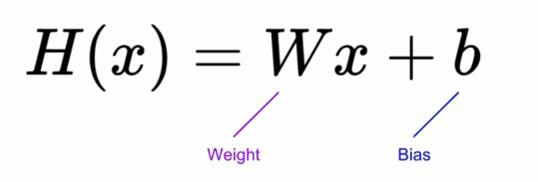
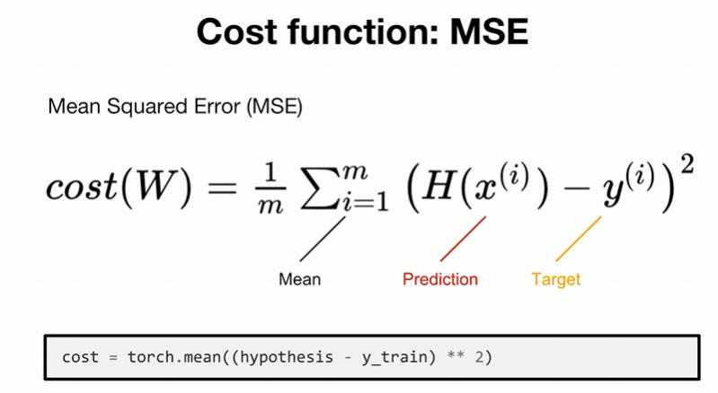

\## 선형 회귀


아래는 모델이 예측한 값인 ‘가설 예측값’ 





```python

x\_train = torch.tensor(\[1.0, 2.0, 3.0]) # Dummy Data


W = torch.zeros(1, requires\_grad=True)

b = torch.zeros(1, requires\_grad=True)


hypothesis = x\_train \* W + b

print(hypothesis)

```


W : 기울기 (가중치)


\- 입력값(x)이 결과(y)에 얼마나 큰 영향을 미칠지 결정함


b : 절편 (편향)


\- 입력값(x)이 0이어도 결과에 기본적으로 더해주는 기초 점수임

\- 그래프를 전체적으로 위아래로 평행이동시키는 역할을 함


hypothesis : 모델의 예측 결과


⇒ x\_train 입력값을 받아서, 초기값이 0인 가중치와 편향으로 선형 예측값을 계산


\## What is the best model?


\- H(x) = y ⇒ 예측 값 H(x)가 진짜 정답 y와 일치하는 모델

\- 데이터의 진짜 규칙에 맞는 W와 b를 찾아내어  Cost가 0에 도달한 상태

&#x20;   

&#x20;   ⇒ 잘 학습된 모델일수록 낮은 Cost를 가짐

&#x20;   


\*\*★ 잘못 알고 있었던 것 ⇒ 반드시 W는 1에 가까워야 하고 b는 0에 가까워야 좋은 모델인것은 아님!\*\*


\*\*ML/DL 알고리즘 목표\*\* 


\*\*⇒ Cost Function 최소화\*\*


\- 연속적인 숫자를 예측하는 회귀문제의 기본적인 비용함수는 MSE(예측값 - 실제값의 평균제곱 오차)임

\- 확률/종류 맞히기 같은 분류 문제는 제곱평균 대신 Cross-Entropy라는 다른 형태의 비용 함수를 사용한다는 것을 알아두기

&#x20;   - cross-entropy는 틀렸을 때 확실하게 벌을 주고, 경사하강법이 안 갇히다는 특징이 있음





\## 경사 하강법


최적화 방식


\- lr (= 알파a)

&#x20;   - 우선 lr의 명칭은 학습률이지만 사실상, 값의 수정 범위로 보는게 더 정확함

&#x20;   - 너무 작게 잡으면 주어진 epoch 안에 다 학습을 하는데 불가능할 것이고, 너무 높게 잡으면 정확한 답을 찾아가는데 큰 부담이 주어질 것으로 보임

\- epochs

&#x20;   - 위에 제시된 학습을 몇 번 반복할 것인가 할당해야 함

&#x20;   - 무작정 숫자 크면 좋을 것 같은데 과적합이라는 문제와 컴퓨팅 자원\&시간 낭비로 이어질 수 있음

\- gradient

&#x20;   

&#x20;   $$

&#x20;   \\text{gradient} = \\frac{\\partial \\text{Cost}}{\\partial W}

&#x20;   $$

&#x20;   

&#x20;   - 수식을 보면 입력 데이터 x, 실제 정답 y, 현재 가중치 w 그리고 cost 함수(MSE)를 정의해 두면, W의 위치에 따라 gradient값은 자동으로 결정됨 조정의 대상이 아님

\- W (가중치)

&#x20;   - lr처럼 계속 건드릴 필요 없이 초기화할 때 딱 한 번 지정해 준 뒤, 학습 과정 동안은 lr과 gradient에 의해 자동으로 조정되는 수동적인 대상임


\## Full Code (★동작 원리★)


\- 아래 코드를 보면 train으로 입력 데이터와 정답 레이블이 나와있는 것을 볼 수 있음

\- 목표는 W는 1에 수렴하도록 하고, Cost는 0이 되도록 줄여나가야 함


```python

import numpy as np

import torch


x\_train = torch.FloatTensor(\[\[1],\[2],\[3]]) # 입력 데이터

y\_train = torch.FloatTensor(\[\[1],\[2],\[3]]) # 정답 레이블


W = torch.zeros(1) # 크기가 1인 텐서(값은 0인 상태)


lr = 0.1 # 학습률 : 값의 수정 범위

epochs = 10 # 학습 횟수 


for epoch in range(epochs + 1) :

&#x20;   hypothesis = x\_train \* W # 선형회귀 : 모델 상태 수치


&#x20;   cost = torch.mean((hypothesis - y\_train) \*\* 2) # cost\_function : 오차 범위 평가 

&#x20;   gradient = torch.sum((W \* x\_train - y\_train) \* x\_train) # 경사하강법 : 최적화


&#x20;   print('Epoch {:4d}/{} W: {:.3f}, Cost: {:.6f}'.format(

&#x20;       epoch, epochs, W.item(), cost.item()

&#x20;       # W는 1로 맞춰야 하며, Cost는 0으로 가야함

&#x20;   ))


&#x20;   W -=  lr \* gradient

```


> 

> 

> 

> Epoch    0/10 W: 0.000, Cost: 4.666667

> Epoch    1/10 W: 1.400, Cost: 0.746666

> Epoch    2/10 W: 0.840, Cost: 0.119467

> Epoch    3/10 W: 1.064, Cost: 0.019115

> Epoch    4/10 W: 0.974, Cost: 0.003058

> Epoch    5/10 W: 1.010, Cost: 0.000489

> Epoch    6/10 W: 0.996, Cost: 0.000078

> Epoch    7/10 W: 1.002, Cost: 0.000013

> Epoch    8/10 W: 0.999, Cost: 0.000002

> Epoch    9/10 W: 1.000, Cost: 0.000000

> Epoch   10/10 W: 1.000, Cost: 0.000000

> 


\## Full Code with torch.optim (실제 사용 코드)


```python

import numpy as np

import torch

from torch import optim # optim 사용을 위해 새로 할당을 해줘야 함


x\_train = torch.FloatTensor(\[\[1],\[2],\[3]]) 

y\_train = torch.FloatTensor(\[\[1],\[2],\[3]]) 


W = torch.zeros(1, requires\_grad=True) # 추가


optimizer = optim.SGD(\[W], lr=0.15) # lr을 따로 선언해주지 않음


epochs = 10

for epoch in range(epochs + 1) :

&#x20;   hypothesis = x\_train \* W


&#x20;   cost = torch.mean((hypothesis - y\_train) \*\* 2) 

&#x20;   


&#x20;   print('Epoch {:4d}/{} W: {:.3f}, Cost: {:.6f}'.format(

&#x20;       epoch, epochs, W.item(), cost.item()

&#x20;       # gradient 따로 선언X, 하단에 optimizer로 계산

&#x20;   ))


&#x20;   optimizer.zero\_grad() # 이전 기울기 초기화

&#x20;   cost.backward() # W에 대한 기울기 계산 (경사하강법 내부적으로 진행)

&#x20;   optimizer.step() # W 업데이트

```


연산 역할 구분


\- 선형 회귀 연산 담당

&#x20;   - hypothesis = x\_train \* W

\- Cost(Loss) 연산 담당

&#x20;   - cost = torch.mean((hypothesis - y\_train) \*\* 2)

\- 경사하강법 담당

&#x20;   - optimizer이 처리함

&#x20;       

&#x20;       optimizer.zero\_grad() # 1. 기존 기울기 초기화

&#x20;       cost.backward()           # 2. 미분(Gradient) 계산

&#x20;       optimizer.step()           # 3. 경사하강법 적용 및 W 업데이트

&#x20;       


차후에 등장할 개념은?


\- nn.Module 기반 모델

\- 적절한 loss 함수

\- 데이터 배치 / loader

\- 여러 층과 비선형성

&#x20;   - 지금까지 하나의 정보로부터 추측하는 모델

&#x20;       

&#x20;       But, 대부분의 추측은 많은 정보를 추합해서 결론을 내리는 모델임

